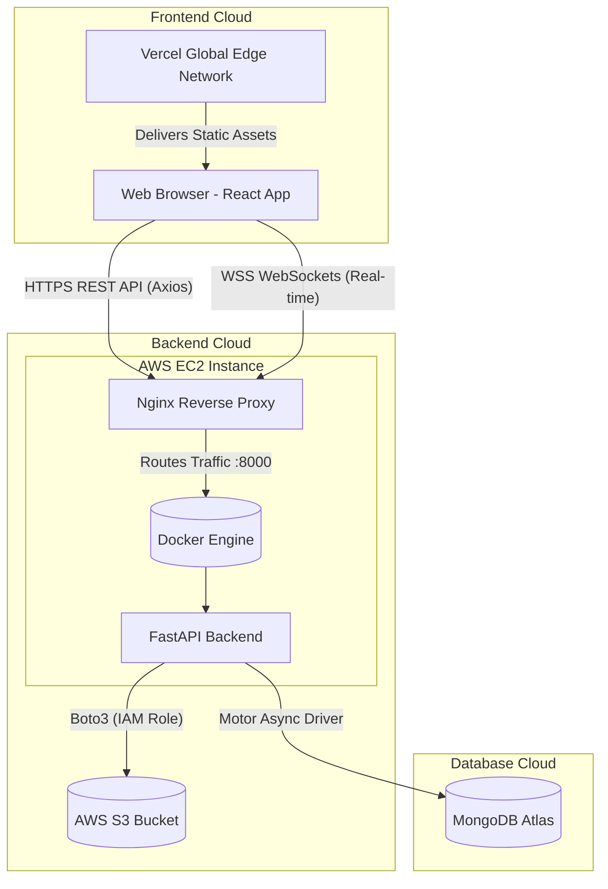

# Nosh Dish Management System 🍽️

A production-ready, highly interactive full-stack web application designed for Nosh AI-powered cooking robots. This system allows **Users** to browse diverse cuisines and let fate decide their next meal, while empowering **Admins** to manage recipes, monitor real-time platform activity, and securely upload dish media.

---

## 🚀 Live Demo & Credentials

The application is fully deployed and accessible via the internet.

- **Frontend (Vercel)**: [https://nosh-dish-management.vercel.app](https://nosh-dish-management.vercel.app)
- **Backend API (AWS EC2)**: `https://nosh-api-ayush.duckdns.org`

### Test Accounts
To evaluate the Dual-Role system and test the toggle functionality, please use the following credentials to log in:

**System Administrator (Dashboard & Management Access)**
- **Email:** `admin@nosh.com`
- **Password:** `Nosh@123456`

**Standard User (Public Display & Randomizer Access)**
- **Email:** `user@nosh.com`
- **Password:** `Nosh@123456`

---

## 🏗️ System Architecture

The Nosh Dish Management System is built on a modern, decoupled cloud architecture.



### Technology Stack
- **Frontend (Vercel)**: React, Vite, Tailwind CSS, Recharts, Lucide Icons.
- **Backend (AWS EC2)**: Python, FastAPI, WebSockets, Uvicorn, Docker, Docker Compose.
- **Database (Atlas)**: MongoDB (NoSQL) accessed via Motor asynchronous driver.
- **Object Storage (AWS S3)**: Secure image uploading using Boto3 and IAM instance profiles.
- **Networking & Security**: DuckDNS, Let's Encrypt (Certbot) SSL/HTTPS, Nginx.

---

## ✨ Key Features

1. **Dual Role Access System**
   - **Users**: Access to the "Spin the Wheel" recipe randomizer, live social feed, and categorized browsing.
   - **Admins**: Access to system analytics, advanced data tables, and CRUD capabilities for managing dishes. Protected by JWT Authentication.

2. **Real-time Synchronization (WebSockets)**
   - The platform utilizes a custom WebSocket connection manager. When an Admin adds or edits a dish, the backend instantly broadcasts the changes to all connected browsers, rendering the UI live without any page refresh.

3. **Intelligent Cloud Media Handling**
   - Admin dish image uploads are securely routed directly to an AWS S3 bucket using EC2 IAM Role permissions, completely omitting the need to expose sensitive AWS Secret Keys in environment variables.

4. **Resilient Data Pipelines**
   - Fallback environment variables within `docker-compose.yml` guarantee backend stability.
   - Robust frontend search algorithms filter out unpopulated API data securely to prevent UI crashes.

---

## 🚀 Setup & Deployment Guide

### Prerequisites
- Docker and Docker Compose installed.
- A MongoDB instance (Atlas).
- An AWS S3 Bucket (For image uploads).

### 1. Environment Configuration
Create a `.env` file in the root directory (where `docker-compose.yml` resides) and provide your connection strings:
```env
MONGODB_URI="mongodb+srv://<username>:<password>@cluster.mongodb.net/nosh_management"
AWS_BUCKET_NAME="your-s3-bucket-name"
AWS_REGION="your-s3-region"
```

### 2. Running the Backend
The backend runs entirely inside a Docker container. To start the API and mount it to port 8000:
```bash
docker compose up -d --build
```
*API Documentation (Swagger) is auto-generated and available at: `http://localhost:8000/docs`*

### 3. Data Population (Seeding)
To instantly populate the database with 30 real-world recipes (via DummyJSON API) and configure the master Admin account (`admin@nosh.com`):
```bash
# To generate the Master Admin and sample dishes:
docker compose exec backend python scripts/seed.py

# To pull 30 real-world recipes into the live database:
docker compose exec backend python seed_recipes.py
```

### 4. Running the Frontend
In a separate terminal, navigate to the `frontend` folder to start the Vite development server:
```bash
cd frontend
npm install
npm run dev
```

---

## 🛡️ Security & Recent Fixes
- **CORS Policies**: Explicitly configured to securely allow Vercel origins while blocking malicious cross-origin requests.
- **Auth Integrity**: Strict JWT Bearer token enforcement on all protected endpoints, including GET requests for Admin tables.
- **Null Safety**: Hardened React search and filter algorithms to safely parse legacy or incomplete recipe records without throwing UI exceptions.
