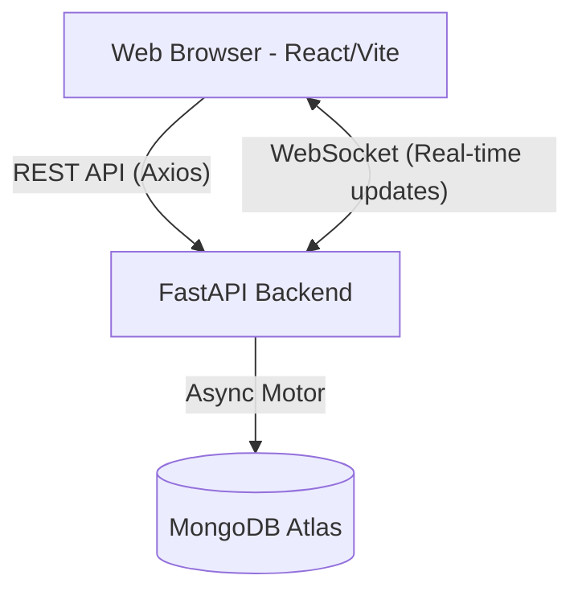

# Nosh Dish Management Dashboard

A production-ready full-stack application for managing dishes available on Nosh AI-powered cooking robots.

## Architecture Overview



### Tech Stack
- **Frontend**: React, Vite, Tailwind CSS, Axios, React Query, Lucide React
- **Backend**: FastAPI, Motor (Async MongoDB), Pydantic, WebSockets
- **Database**: MongoDB
- **Infrastructure**: Docker & Docker Compose

## Setup Guide

### Prerequisites
- Docker and Docker Compose installed
- MongoDB instance (Atlas or local)

### Environment Variables
1. Copy `backend/.env.example` to `backend/.env`.
2. Provide your `MONGODB_URI` in the `.env` file.

### Local Development (Docker)

To run the entire application locally using Docker:

```bash
docker-compose up -d --build
```

- Frontend will be available at: http://localhost:3000
- Backend API will be available at: http://localhost:8000
- API Documentation (Swagger): http://localhost:8000/docs

### Database Seeding
To populate the database with sample dishes, you can run the seed script:
```bash
docker-compose exec backend python scripts/seed.py
```

## API Documentation
The API provides standard RESTful endpoints and a WebSocket connection for real-time updates.
Visit `http://localhost:8000/docs` to see the full Swagger documentation.

- `GET /api/v1/health` - Health check
- `GET /api/v1/dishes` - List all dishes
- `PATCH /api/v1/dishes/{dishId}/toggle` - Toggle the publish status of a dish
- `WS /ws/dishes` - WebSocket endpoint for real-time dish updates and activity logs.

## Design Highlights
- **Responsive**: Adapts perfectly from Desktop to Tablet to Mobile screens.
- **Premium UI**: Uses a custom Tailwind palette with sleek dark mode accents for a startup operations dashboard feel.
- **Real-time**: Leverages WebSockets to push changes instantly to all connected clients without refreshing.
